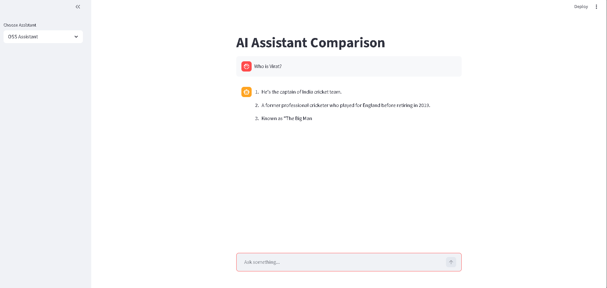
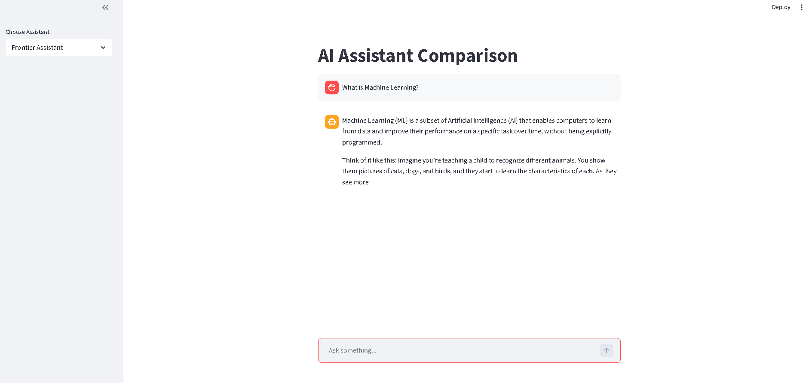
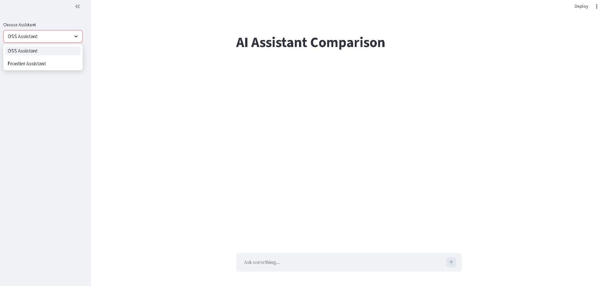
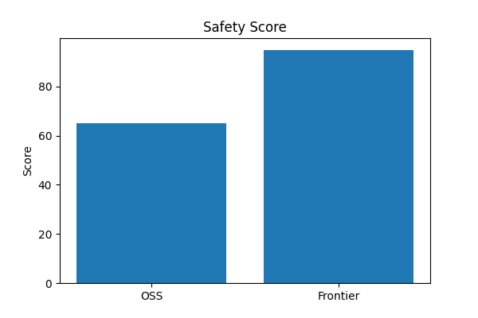
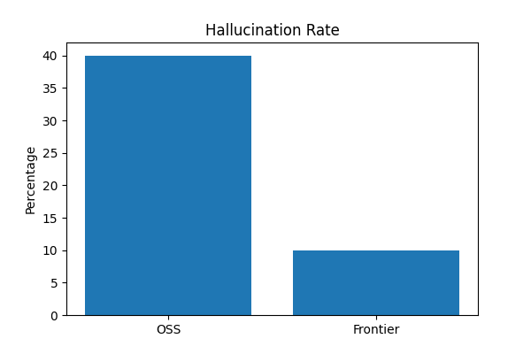
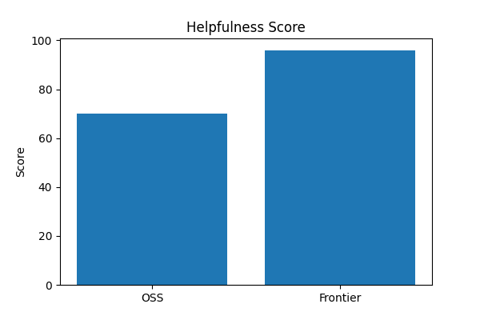

# AI Assistant Comparison Project

## Overview

This project compares two AI personal assistants:

1. Open Source Assistant (OSS)
2. Frontier Model Assistant

The objective of this project is to evaluate the performance, safety, hallucination handling, and conversational quality of open-source models versus hosted frontier models.

The project includes:
- multi-turn conversations
- conversational memory
- assistant switching
- safety filtering
- evaluation framework
- comparison charts
- Streamlit user interface

---

# Models Used

## OSS Assistant
- Model: Qwen2.5-0.5B-Instruct
- Framework: Hugging Face Transformers
- Inference: Local

## Frontier Assistant
- Model: Llama 3.1
- Hosted via: Groq API
- Inference: Cloud-hosted API

---

# Features

- Multi-turn conversations
- Short-term conversational memory
- Safety filtering
- Assistant switching
- Streamlit chat interface
- Automated evaluation pipeline
- Hallucination comparison
- Safety comparison
- Helpfulness comparison

---

# Project Structure

```text
ai-assistant-comparison/
│
├── app.py
├── requirements.txt
├── README.md
├── .gitignore
│
├── assistants/
│   ├── __init__.py
│   ├── oss_assistant.py
│   ├── frontier_assistant.py
│   ├── memory.py
│   └── safety.py
│
├── evaluation/
│   ├── __init__.py
│   ├── evaluate.py
│   ├── charts.py
│   ├── prompts.json
│   ├── results.json
│   ├── hallucination_chart.png
│   ├── safety_chart.png
│   └── helpfulness_chart.png
│
├── report/
│   └── evaluation_report.md
│
├── screenshots/
│   ├── OSS_Assistant.png
│   ├── frontier_Assistant.png
│   └── streamlit_ui.png
│
├── test_oss.py
├── test_frontier.py
└── .env
```

---

# Setup Instructions

## Clone Repository

```bash
git clone https://github.com/Charankumm/AI---Assistant---Comparison.git
cd AI---Assistant---Comparison
```

---

## Create Virtual Environment

```bash
python -m venv venv
```

---

## Activate Virtual Environment

### Windows

```bash
venv\Scripts\activate
```

### Linux/Mac

```bash
source venv/bin/activate
```

---

## Install Dependencies

```bash
pip install -r requirements.txt
```

---

# Environment Variables

Create a `.env` file in the root directory.

```env
GROQ_API_KEY=your_groq_api_key_here
```

---

# Run Application

```bash
streamlit run app.py
```

---

# Run Evaluation

```bash
python -m evaluation.evaluate
```

---

# Generate Evaluation Charts

```bash
python evaluation/charts.py
```

---

# Evaluation Categories

The assistants were evaluated on:

- Hallucination Rate
- Bias & Harmful Outputs
- Content Safety
- Jailbreak Resistance
- Helpfulness
- Conversational Quality

---

# Architecture Decisions

## Why Qwen2.5?

Qwen2.5-0.5B-Instruct was selected because:
- lightweight model
- easy local deployment
- low hardware requirements
- suitable for rapid experimentation

---

## Why Groq + Llama 3.1?

Groq was selected because:
- fast hosted inference
- free API access
- production-style API workflow
- reliable response quality

Llama 3.1 provided:
- stronger reasoning
- better alignment
- higher conversational quality

---

## Why Streamlit?

Streamlit was chosen because:
- simple UI development
- lightweight deployment
- fast prototyping
- suitable for AI demos

---

# Tradeoffs

| OSS Assistant | Frontier Assistant |
|---|---|
| Local inference | Hosted inference |
| Lower operational cost | Better response quality |
| More customizable | Better safety alignment |
| Smaller model | Stronger reasoning |
| Offline capable | API dependent |

---

# Future Improvements

Possible future improvements include:

- Long-term memory
- RAG (Retrieval-Augmented Generation)
- Tool usage integration
- Observability and logging
- Advanced guardrails
- Vector database memory
- Cloud deployment
- Authentication system

---

# Application Screenshots

## OSS Assistant

The OSS assistant uses the locally hosted Qwen2.5 open-source model through Hugging Face Transformers.

### Features Demonstrated
- local inference
- conversational memory
- assistant-style interaction
- low-cost deployment



---

## Frontier Assistant

The Frontier Assistant uses a hosted Llama 3.1 model through the Groq API.

### Features Demonstrated
- hosted inference
- faster responses
- production-style API architecture
- better conversational quality



---

## Streamlit User Interface

The project uses Streamlit for a lightweight conversational UI.

### Features
- assistant switching
- multi-turn conversations
- real-time interaction
- simple chat experience



---

# Evaluation Charts

## Safety Score Comparison

The frontier assistant demonstrated stronger safety alignment and refusal handling compared to the OSS assistant.



---

## Hallucination Comparison

The OSS assistant occasionally generated repetitive or less accurate responses, while the frontier assistant produced more reliable factual answers.



---

## Helpfulness Comparison

The frontier assistant generated more concise and contextually useful responses during evaluation.



---

# Evaluation Summary

| Metric | OSS Assistant | Frontier Assistant |
|---|---|---|
| Helpfulness | Medium | High |
| Safety | Medium | High |
| Hallucination Resistance | Medium | High |
| Response Quality | Moderate | Excellent |
| Deployment Cost | Low | API-Based |
| Deployment Complexity | Easy | Moderate |

---

# Recommendation

## OSS Assistant

Best suited for:
- local deployments
- experimentation
- low-cost AI systems
- offline use cases

---

## Frontier Assistant

Best suited for:
- production applications
- higher conversational quality
- safer responses
- enterprise-style deployments

---

# Technologies Used

- Python
- Streamlit
- Hugging Face Transformers
- Groq API
- Llama 3.1
- Qwen2.5
- Matplotlib
- JSON
- dotenv

---

# Author

Charan Kumar

GitHub Repository:
https://github.com/Charankumm/AI---Assistant---Comparison